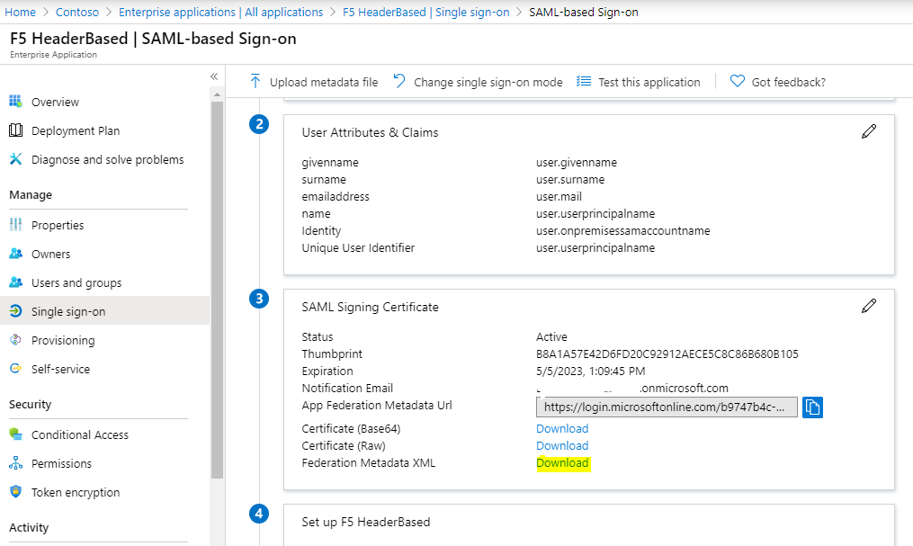

# Introduction

The configuration of your F5 with AAD integration can be based the Guided Configuration wizard, or through manual steps if desired. This chapter describes the basic creation of an application in Azure AD based on the F5 object available in the Marketplace.

## Prerequisites

To get started, you need the following items:

- An Azure AD subscription. If you don't have a subscription, you can get a free account.

## Creating an application in AAD

The (web) application hosted by F5 will require an "Enterprise Application" in Azure AD. This Enterprise Application will control who has (initial) access and establish the SSO functionality to F5.

1. Open Azure Active Directory in Azure and select **Enterprise Applications**
1. Click **+ New Application** and then under **Add from the Gallery** type **F5**
1. Give the application a new name such as `<Header App>` and click **Add**
1. Once the application details open, select **Single sign-on** and select **SAML**
1. In the pop-up select **No, I'll save later**
1. Under the SAML Signing Certificate download the **Federation Metadata XML** file and save it.

## SAML Attribute options

In some configurations it is desired to have some on-premises AD attributes available. This includes the sAMAccountName and onPremises user FQDN and NetBios domain name. These attributes will be required in the Kerberos based scenario's below. To add these attributes:

1. Open Azure Active Directory in Azure and select **Enterprise Applications**
1. search for your created application (`<App>`) and open the properties of the application
1. Once the application details are open, select **Single sign-on**
1. Click the pencil / edit button under **2. User Attributes and Claims**
1. Click **+ Add new claim** in the top bar

- for the name type **onpremisessamaccountname**
- for the source attribute, select **user.onpremisessamaccountname**
- Click **Save**

- for the name type **usernetbios**
- for the source attribute, select **user.netbiosname**
- Click **Save**

- for the name type **userdnsdomainname**
- for the source attribute, select **user.dnsdomainname**
- Click **Save**

## Next steps

This concludes the configuration of the Azure AD configuration which is required for almost all F5 scenario's such as Kerberos, Header based and advanced Header injection scenarios.

optionally - the import of an SSL certificate to be used for publishing the application
- [F5 - Import a PFX and configure the client SSL profile](f5-client-ssl.md)

F5 supports multiple ways for integrating with Azure AD. The easiest is the Guided Configuration, but it is also possible to manually configure the SP and IdP to be used for other scenario's:

- [F5 - Azure AD Integration - Guided Configuration for Kerberos](f5-kerberos-guided.md) - a guided tutorial for deploying Kerberos based web applications.
- [F5 - Azure AD Integration - Guided Configuration for HTTP Headers](f5-header-guided.md)

- [F5 - Azure AD Integration - Manual creation of SP and IdP](f5-aad-saml-manual.md) - tutorial for configuring the Service Provider and IdP based on Azure AD.
- [F5 - Azure AD Integration - Manual deployment of Advanced Header Based Application](f5-advanced-header.md) - tutorial for deploying a header based web application with 3rd party LDAP store.
