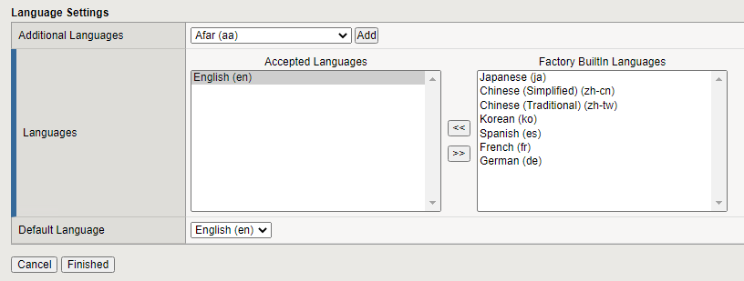
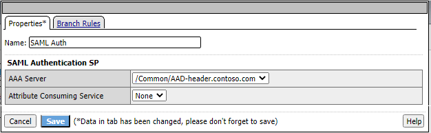
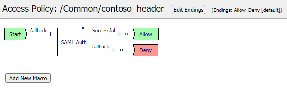

# F5 - Azure AD Integration - Access Profile

## Introduction

Access Profiles in F5 are used to provide the policy configuration for virtual server (published applications). While an access policy can contain many steps, the default steps for integrating with Azure AD are the same.

An access profile has a start and an ending. While start is only a single entry point, the endings may result in either Allow or Deny. For the SAML based login there is an obvious "Allow" ending when the SAML authentication succeeds and a "Deny" when it fails.

> [!NOTE]
> This walkthrough uses sample names and values from a company called Contoso. Replace these with your own. For example:
>
> - Domain name - **Contoso**
> - Application Name - **Header App**
> - Application URL - **https://header.contoso.com**

## Creating an access policy in F5

Open the F5 Admin console and
1. Go to **Access : Profiles / Policies : Access Profiles (Per-Session Policies)** and click **Create...**
1. Give the access policy a name (`<Header App>`) and set the profile type to **LTM-APM**
1. Set an **Accepted Language** by clicking a language and clicking **<<** then click **Finished**

1. Click **Edit** under the Per-Session Policy column
1. A new window will open with the Access Policy showing `<start>` + `<Deny>`
1. Click the **+** sign. A pop-up will be shown
1. In the pop-up, select the **Authentication** tab and there select **SAML Auth** and click **Add Item**
1. A new pop-up will be shown for the SAML Auth configuration. In the **AAA Server** dropdown list select the earlier created IdP (/Common/`<AAD - header.contoso.com>`) and click **Save**

The SAML Auth step will be added to the Access Policy flow and it will now show 2 endings (successful and failback).

1. Click the **Deny** in the **Successful** branch and in the pop-up change the value to **Allow** and click **OK**
1. Click Apply Access Policy on the top of the page

This concludes the configuration of the initial access policy.

## Next steps

This concludes the configuration of the SP, IdP and Azure AD configuration which is required for almost all F5 scenario's such as Kerberos, Header based and advanced Header injection scenarios.

- [Publishing Advanced Header based applications with AAD & F5](f5-advanced-header.md) - an advanced scenario where an external LDAP store is used to inject HTTP HEADERS to the backend webserver.
- [Publishing Kerberos based applications with AAD & F5](f5-kerberos.md)
- [Publishing Header based applications with AAD & F5](f5-header.md)
