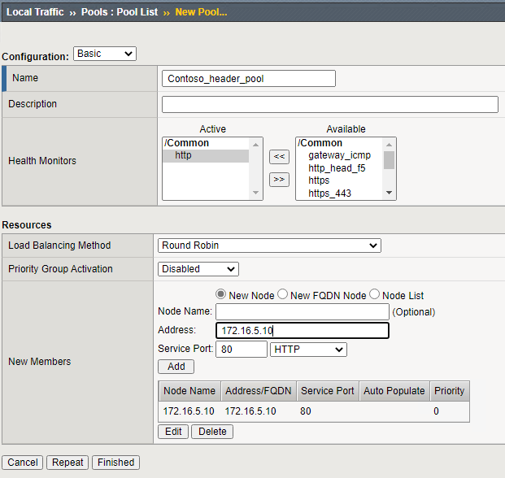
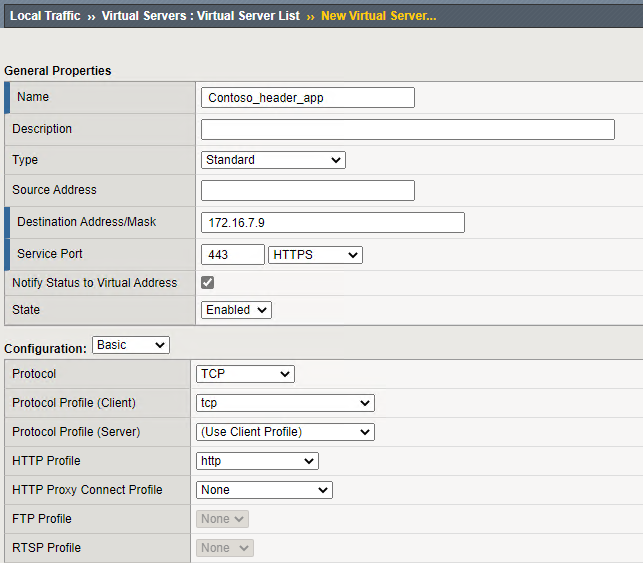
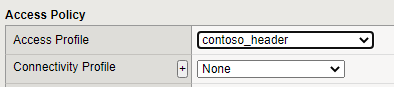
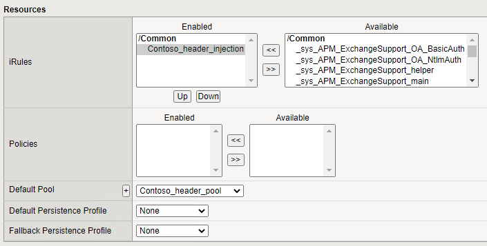

# F5 - Azure AD Integration - Header Based

## Introduction

In this scenario additional SAML attributes for the logged in user are collected and sent the backend web application in Headers. There is also a Guided Configuration version available for this tutorial.

- [F5 - Azure AD Integration - Header Applications - Guided Config](f5-header-guided.md)

## Prerequisites

To complete this tutorial, make sure you have completed the following guides:

- [F5 - Azure AD Integration - Create an Enterprise Application in AAD](f5-aad.md)
- [F5 - Azure AD Integration - Manual creation of SP and IdP](f5-aad-saml-manual.md)
- [F5 - Azure AD Integration - Manual creation of an Access Profile](f5-accessprofile.md)

## Creating an iRule to inject HEADERS based on SAML attributes

Headers need to be added through an iRule. iRules are executed on the connection and provide advanced capabilities for session management. In our case we want to add the PartnerID as an HTTP Header to the backend server.

1. Go to **Local Traffic >> iRules : iRule List** and click **Create**
1. Provide a name for the iRule (`<Contoso_HeaderInjection>`)
1. In the **Definition** paste the following code:

```iRule
when RULE_INIT {
    set static::debug 0
}
when ACCESS_ACL_ALLOWED {

set SAMACCOUNT [ACCESS::session data get "session.saml.last.attr.name.onpremisessamaccountname"]
set UPN [ACCESS::session data get "session.saml.last.identity"]

if { $static::debug } { log local0. "SAMACCOUNT = $SAMACCOUNT" }
if { $static::debug } { log local0. "UPN = $UPN" }

  if {!([HTTP::header exists "SAMACCOUNT"])} {
    HTTP::header insert "SAMACCOUNT" $SAMACCOUNT
  } else {
    HTTP::header replace "SAMACCOUNT" $SAMACCOUNT
  }

  if {!([HTTP::header exists "UPN"])} {
    HTTP::header insert "UPN" $UPN
  } else {
    HTTP::header replace "UPN" $UPN
  }
}
```

The rule will take the SAML attribute sAMAccountName replicated from on-premises and inject it as header SAMACCOUNT to the backend server. It is possible to add additional or different attributes. See - [F5 - Azure AD Integration - Create an Enterprise Application in AAD](f5-aad.md) - on how to add additional attribute claims.

## Creating a Virtual Server entry

Now that the initial configuration is complete we can publish a backend webserver. This will combine the created Access Policy and iRule. The Access Policy will provide the authentication and LDAP Query and the iRule will be injecting the retrieved LDAP attribute into an HTTP Header.

First we will need to create a backend pool. An object containing the servers / ports for the backend web application.

1. Go to **Local Traffic ›› Pools : Pool List** and click **Create...**
1. Give a name for the new pool (`<Header_App_Pool>`)
1. Set a health monitor by adding http to the Active selection under Monitoring by clicking http and then **<<**
1. Under Resources \ New Members \ Address type the FQDN or IP address of the backend webserver
1. Under service port set the port (`<80>`) and the service type to HTTP and click **Add**
1. Click **Finished**



To publish the backend webserver

1. Go to **Local Traffic ›› Virtual Servers : Virtual Server List** and click **Create...**
1. Provide a name for the virtual server (`<Header_App>`) and provide a destination address / mask. This will be the IP address F5 will be listening on.
1. Set the service port to **443** and the service to **HTTPS**
1. Under configuration for the **HTTP profile** set it to **http**



5. Under Configuration for the SSL Profile Client, add your SSL Client profile created earlier `<Contso_SSL>`
1. Under Access Policy for the Access Profile, set the value to the earlier created Access Profile `<Header App>`



7. Under the Resources option, add the earlier created iRule `<Contoso_HeaderInjection>`
1. Under the Resources option set the pool to the earlier created pool (`<Header_App_Pool>`).
1. Click **Finished**



The Virtual Server should have a green indicator in front of the name ensuring the backend webserver is available. This concludes the configuration.

## Testing

> [!NOTE]
Prior to users being able to connect to the website, the FQDN of the website needs to be resolvable. While theoretically the certificate doesn't have to match the URL this is highly advised. Make sure your test client can find the IP address of the virtual server for the configured name for the website. This can be done through DNS or by manipulating the local hosts file on the test client.
