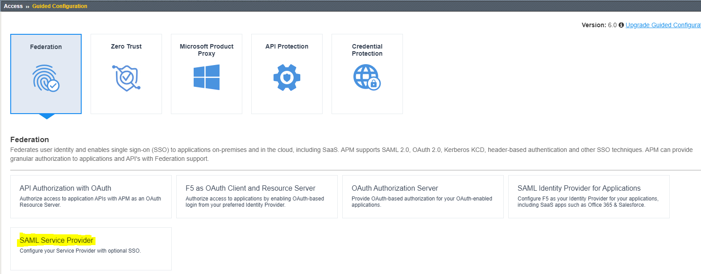
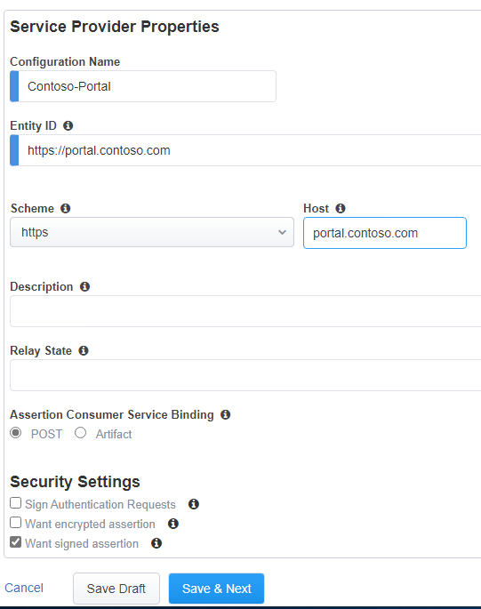
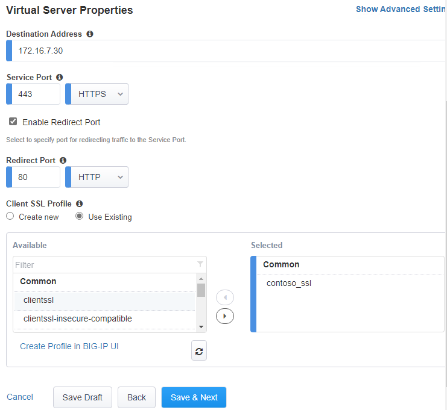
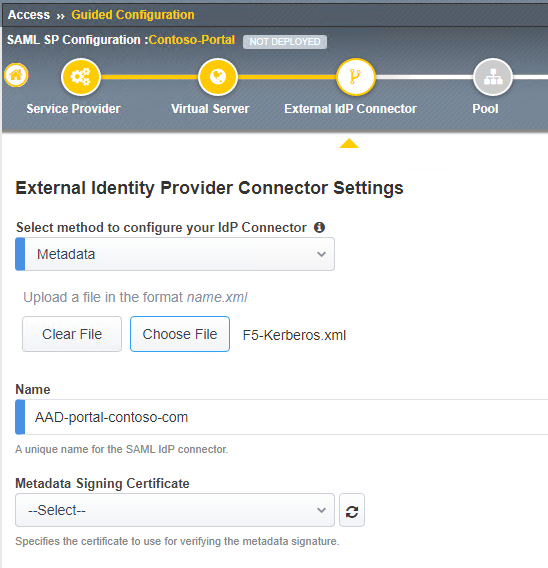
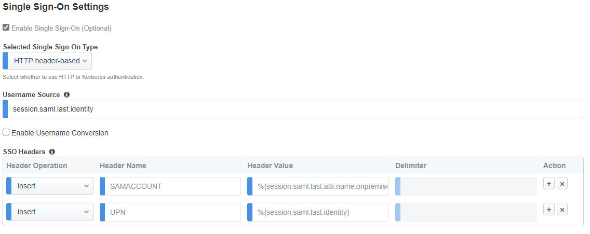

# F5 - Azure AD Integration - HTTP Header-based Guided Configuration

## Introduction

In this scenario additional SAML attributes for the logged in user are collected and sent the backend web application in HTTP Headers. There is also a Manual Configuration version available for this tutorial.

- [F5 - Azure AD Integration - Header Applications - Guided Config](f5-header-based.md)

## Prerequisites

To complete this tutorial, make sure you have completed the following guides:

- [F5 - Azure AD Integration - Create an Enterprise Application in AAD](f5-aad.md)

## Guided Configuration for HTTP Header-based applications

This chapter describes the configuration to use F5 in front of HEADER based web applications with Azure AD using the F5 built-in Guided Configuration wizard.
In order to start the Guided Configuration:
1. Login to the F5 device and set it up with NTP, DNS according to the manufacturers guide
2. Select Guided Configuration under the **Access** blade

3. Select **Federation** and **SAML Service Provider** and the wizard will start.

The main page will show if you have the required configuration done, this includes DNS, NTP, interfaces and routes. It also shows you the steps and items related to the configuration.

4. Click **Next** on the main page to update the Service Provider options
5. On the Servicer Provider Options page
- Give the configuration a name (must be unique), and type the Entity ID. This is the value that needs to match the Identifier (Entity ID) from Azure AD. For example; `<https://portal.contoso.com/>`
- Under the host field, type the URL for the website, `<https://portal.contoso.com>`
- Type a description if required

5. click **Save & Next**
6. On the Virtual Server Properties page, the system requests the input for:
- Destination Address: This is the IP address the F5 will use to host the website on.
- Mask: not used
- Port: port used to host the website (should be HTTPS)
- Enable Redirect port: (optional)
- Redirect Port: 80 (optional)
- Client SSL Profile: (select existing)
- add the previously configured client SSL profile

7. On the External Identity Provider page select the Metadata option from the dropdown list and click **Choose File**.
8. Browse to the downloaded XML file from the AAD federation metadata XML field and upload it.

[Note] Make sure special characters and spaces are removed from the file.

9. Give the Identity Provider a name. For example; `<AAD-portal-contoso-com>`
10.	There is no need to upload / select the Metadata Signing Certificate.
11.	Click **Save & Next**

The backend servers hosting our web application are added to a "pool" of servers. Even if you have one backend server this is added into a pool.

12.	On the Pool Properties page enter the information for the web servers.
- Select a Pool - **Create New**
- Load balancing method - **Round Robin**
- Pool Servers - <ip of web server> - `<port of website>`

13.	On the Single Sign-On page, click **Enable Single Sign-On (optional)**
14.	Select **HTTP Header-based** as the type.
15.	For the SSO headers:

- Set the Header Operation to **Insert**
- Set Header Name to SAMACCOUNT
- Set Header value to %{session.saml.last.attr.name. onpremisessamaccountname}

16.	Click **+** to add a new row

- Set the Header Operation to **Insert**
- Set Header Name to UPN
- Set Header value to %{ session.saml.last.identity}

17.	Click **Save & Next**
18.	On the Endpoint Checks Properties, click **Save & Next**
19.	On the Timeout Settings, click **Save & Next**
20.	Review the settings, and click **Deploy**
21.	click **Finish**

This completes the configuration of the F5 in Header based applications, using SAML attributes to be injected in the HTTP Headers.
