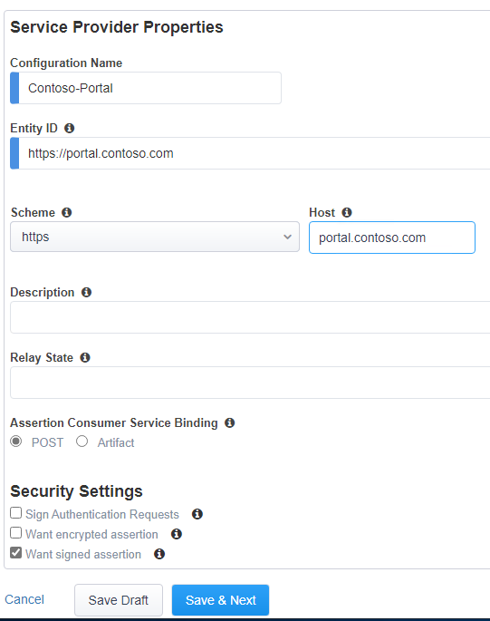

# Introduction

This chapter describes the configuration to use F5 in front of Kerberos based web applications with Azure AD using the F5 built-in Guided Configuration wizard

> [!NOTE]
> This walkthrough uses sample names and values from a company called Contoso. Replace these with your own. For example:
>
> - Domain name - **Contoso**
> - Application Name - **Kerberos App**
> - Application URL - **https://portal.contoso.com**

## Prerequisites

To get started, you need the following items:

Deploying the guided solution requires the following license:

- F5 BIG-IP® Best bundle (or)
- F5 BIG-IP Access Policy Manager™ (APM) standalone license - with guided configuration
- F5 BIG-IP Access Policy Manager™ (APM) add-on license on an existing BIG-IP F5 BIG-IP® Local Traffic Manager™ (LTM).

In addition to the above license, the F5 system may also be licensed with:

[!NOTE] The default trial license for F5 APM will not enable the Guided Configuration blade.

## Guided Configuration

In order to start the Guided Configuration:

1. Login to the F5 device and set it up with NTP, DNS according to the manufacturers guide
1. Select Guided Configuration under the **Access** blade

3. Select **Federation** and **SAML Service Provider** and the wizard will start.

The main page will show if you have the required configuration done, this includes DNS lookups (for Kerberos UPN lookups, NTP, interfaces and routes. It also shows you the steps and items related to the configuration.

4. Click Next on the main page to update the Service Provider options
1. On the Servicer Provider Options page

- Give the configuration a name (must be unique), and type the Entity ID. This is the value that needs to match the Identifier (Entity ID) from Azure AD. For example; https://portal.contoso.com/
- Under the host field, type the URL for the website, `<https://portal.contoso.com>`
- Type a description if required

5. click **Save & Next**
1. On the Virtual Server Properties page, the system requests the input for:

- Destination Address: This is the IP address the F5 will use to host the website on.
- Mask: not used
- Port: port used to host the website (should be HTTPS)
- Enable Redirect port: (optional)
- Redirect Port: 80 (optional)
- Client SSL Profile: (select existing)
- add the previously configured client SSL profile

7. On the External Identity Provider page select the Metadata option from the dropdown list and click **Choose File**.
8. Browse to the downloaded XML file from the AAD federation metadata XML field and upload it.

[!NOTE] Make sure special characters and spaces are removed from the file.

9. Give the Identity Provider a name. For example; AAD-portal-contoso-com
10. There is no need to upload / select the Metadata Signing Certificate.
11. Click **Save & Next**

The backend servers hosting our web application are added to a "pool" of servers. Even if you have one backend server this is added into a pool.

12. On the Pool Properties page enter  the information for the web servers.

- Select a Pool - **Create New**
- Load balancing method - Round Robin
- Pool Servers - `<ip of web server>` - `<port of website>`

13. On the Single Sign-On page, click **Enable Single Sign-On (optional)** 
14. select **Kerberos** as the type.
15. Click **Show Advanced Configuration** and set the following information:

- Username Source: session.saml.last.attr.onpremisessamaccountname
- Kerberos Realm: the FQDN of your AD (CONTOSO.LOCAL)
- Account Name: the F5 APM account (f5apm)
- Account Password: <the f5apm password>
- KDC: (optional IP address of a DC – if DNS is configured leave empty)
- UPN Support: (enable if no IP address provided in KDC)
- SPN Pattern: HTTP/%h

[!NOTE] some webservers require a 401 challenge prior to F5 providing the KCD. If that is the case, set the Send Authorization to On 401 Status Code

16. Click **Save & Next**
1. On the Endpoint Checks Properties, click **Save & Next**
1. On the Timeout Settings, click **Save & Next**
1. Review the settings, and click **Deploy**
1. click **Finish**

## Testing

Make sure the web server accepts Kerberos for authentication. For more information check:

- [Setup IIS for Kerberos](iis-kerberos.md)

## Other steps

It is possible to manually edit the guided configuration applied. This could be useful if additional configuration is required, for example custom iRules, AAD Guest access configuration and more.

In order to remove the lock and allow for custom configurations:

1. Login to the F5 device
1. Select Guided Configuration under the **Access** blade
1. click the lock next to the deployed configuration
1. On the pop-up window select **Are you sure you want to disable Manage Configuration** and click **OK**

