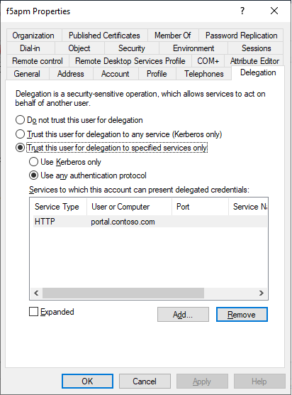

# Introduction

This chapter describes the configuration to use F5 in front of Kerberos based web applications with Azure AD. 

> [!NOTE]
> This walkthrough uses sample names and values from a company called Contoso. Replace these with your own. For example:
>
> - Domain name - **Contoso**
> - Application Name - **Kerberos App**
> - Application URL - **https://portal.contoso.com**

## Design


## Configure Azure Active Directory

The (web) application hosted by F5 will require an "Enterprise Application" in Azure AD. This Enterprise Application will control who has (initial) access and establish the SSO functionality to F5. Follow the guide below, and replace the Application Name and Application URL to your kerberos application values.

> - [Publishing applications with AAD & F5](f5-header-based.md)

## Configure Active Directory

As F5 will be using Active Directory to convert Azure AD SAML claims to Kerberos authentication, it will need to be able to query Active Directory and request Kerberos tickets on behalf of users.

The following PowerShell command will create a user called f5apm with a password and set a SPN on the user account. Change the `<password>` to something unique, and change `<yourdomain.local>` to your domain FQDN and run the command:

```powershell
$f5apmPassword = ConvertTo-SecureString "<password>" –asplaintext –force

New-ADUser -Name "f5apm" -UserPrincipalName f5apm@<yourdomain.local> -SamAccountName "f5apm" -PasswordNeverExpires $true -Enabled $true -AccountPassword $f5apmPassword

setspn -A HOST/f5apm f5apm
 
 ```

The backend webserver hosting the application also requires an SPN. If this is not yet set, please run the following command: 

```
setspn -A HTTP/portal.contoso.com webserver01
```

Next, we need to grant the F5 account to request kerberos tickets on behalf of the user for the URL hosted on the webserver.

1. Browse to the f5apm user in AD Users & Computers and open its properties
2. select the delegation tab and select **Trust this user for delegation to specified services only – select Use any authentication protocol**



3. Select **Add** and type the name of the webserver (or service principal) hosting the website where we registered the SPN HTTP/portal.contoso.com on.
1. In the list shown, select `<portal.contoso.com>` and click **OK**.
1. Click **OK** to close the properties of the f5apm user.

This concludes the AD configuration.


## Next steps

F5 has implemented a Guided Configuration setup, but it is also possible to be manually configure the device in advanced Kerberos scenarios. Choose the scenario: 

- [Guided Configuration](f5-kerberos-guided.md)
- [Manual Configuration](f5-kerberos-manual.md)

