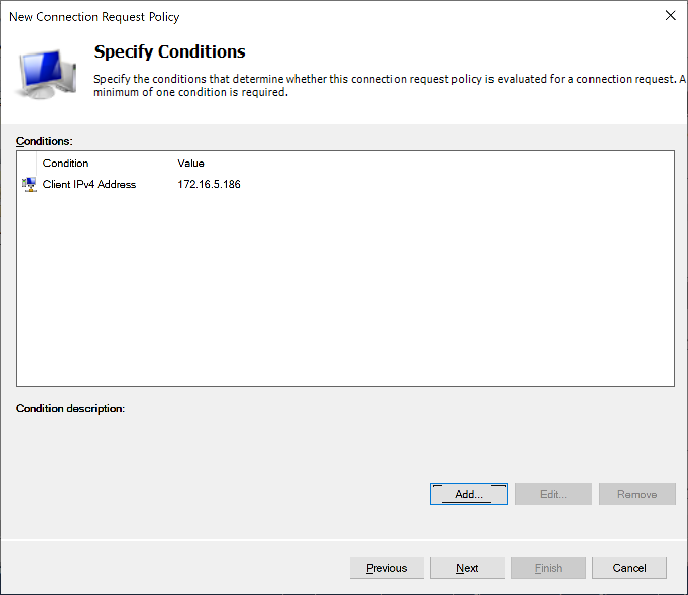

# Introduction

In this tutorial, you'll learn how to integrate F5 with Azure Active Directory (Azure AD) with the NPS MFA Agent

## Prerequisites

You will require an Active Directory, an Azure Active Directory (both connected using Azure AD Connect)
an F5 appliance with APM module

## F5 & Radius (Azure MFA NPS Agent)

You can integrate F5 with an external radius server, this is not something new. What is new is that that Radius Server can now also have the Azure MFA NPS extension installed. This tutorial will discuss the integration for radius authentication with the Azure MFA NPS agent. When you install the default Azure MFA NPS agent the default policies in NPS dictate a call needs to have username & password, but this tutorial also covers using the radius servers as a step-up MFA provider.

### Installing NPS

Network Policy and Access Services are a role within the Windows Server system. After installing a Windows Server (add the server to the domain  - the NPS agent maps the users to AD), add the role through the server manager (or powershell) and open the configuration:

```powershell
Install-WindowsFeature NPAS -IncludeManagementTools
#To open the Firewall ports, run
New-NetFirewallRule -DisplayName 1812 -Profile 'Any' -Direction Inbound -Action Allow -Protocol UDP -LocalPort 1812
```

### Installing the NPS agent

The full installation guide for the NPS agent can be found on: https://docs.microsoft.com/en-us/azure/active-directory/authentication/howto-mfa-nps-extension

- Make sure to disable IE Enhanced security - as the NPS Azure MFA agent will trigger a login through the built-in web browser

But in short, download the package from: https://aka.ms/npsmfa and install the agent on the NPS server. Next open PowerShell in an administrative prompt and run:

```powershell
cd "C:\Program Files\Microsoft\AzureMfa\Config"
.\AzureMfaNpsExtnConfigSetup.ps1
```

1. Sign in to Azure AD as an administrator.
1. PowerShell prompts for your tenant ID. Use the Directory ID GUID
1. PowerShell shows a success message when the script is finished.

### Configuring the NPS Client

1. Next, a client needs to be configured (the F5 connecting into the radius server). For this, go to **Radius Clients and Servers -> Clients**
1. Add a new client and give it a name (F5) and set the IP address for the client – matching your F5 IP address (internal or closest route).
1. Provide a client secret or generate a new one. Copy the client secret as this will be required in a later step.


Next is the configuration of the policies, there are 2 policies in NPS, Connection Policies and Network Policies.

### Policies

Radius by default expects a username and a password, which in many cases is required to provide a secure authentication. But in this case we will rely on the NPS/MFA server to only provide step-up authentication based on the username. A federated login (or user without password) will not be able to provide the password in the system and thus we will only require the username.
This means we need to disable the authentication for the Radius Client. While it is possible to alter the built-in policy (use Windows authentication for all users), this tutorial will describe the creation of a new policy that is only applied to the F5 client created earlier.

1. Create a new Connection Request Policy by right clicking Connection Request Policies and selecting New.
1. Provide a name for the policy (Unauthenticated MFA)
1. And leave the type of network access server to **unspecified**
1. On the specify conditions page, select **Add**

- Go to Radius Client Properties
- Select Client IPv4 Address and click **Add**
- In the pop-up type the IP address of the F5 device and click **OK**



5. Click **Next**
1. Under the Specify Connection Request Forwarding select **Accept users without validating credentials** under the Authentication tab.


7. Click **Next**
1. On the configure settings page, click **Next**
1. Review the settings and click **Finish**
1. Change the order so the newly created policy is on top


Next a network policy needs to be configured.

1. Right click Network Policies and select **New**
1. Provide a name for the policy "Unauthenticated MFA"
1. Set the type of network access server to **Unspecified**
1. Click **Add** on the conditions window
1. Select **Client IPv4 Address** under **Radius Client Properties**


6. Click **Add**
1. In the pop-up type the IP address for the F5 device (same as Radius Client) and click **OK** and click **Next**
1. Click **Granted Access** in the specify permission window and click **Next**
1. On the Configure Authentication Methods window, select **Unencrypted Authentication (PAP, SPAP)** and click **Next**, click **No** on the pop-up
1. Click **Next** on the constraints window
1. Click **Next** on the Configure Settings window
1. Review the settings made and click **Finish**


The NPS server is now configured.

### F5 Radius configuration

F5 Access policies can make use of the radius server configured in NPS. When F5 now sends the username to the radius server, the Azure MFA agent will kick-in and request the user to perform an MFA (note that only response is possible in this scenario – no code challenge).
In order to configure the NPS server as the Radius server in F5:

1.	Go to **Access >> Radius** and click **Create**
2.	Provide a name for the radius server <azure_mfa>
3.	Select **Authentication** for the mode
4.	Set the Server Connection to **Direct** (or pooled if you create multiple NPS installations)
5.	And provide the IP address of the NPS server
6.	Leave the port to **1812**
7.	Type the secret used earlier in NPS – when creating the Client in NPS
8.	Set the Timeout to **60 seconds**
9.	Click **Finish**


Next is the creation of an access policy. This defines the authentication method used, for this POC I will first ask the user to provide their username, to then trigger an MFA for the user. Note that we do not require the password for the user in this POC – this will be added later. While we do not ask for the password, the user must still exist in Azure (users can login with sAMAccountName or UPN, but UPN must match a user in AAD - configured for MFA)

1. Go to **Access >> Profiles / Policies : Access Profiles (Per-Session Policies)** and click **Create**
2. Give the profile a name and select **LTM-APM** for the Profile Type
3. Under language settings, select **English (en)** and click **<<** to add it to the profile and click **Finished**
4. The profile will be created, after creation click **Edit** on the created policy in the Per-Session Policy column
5. A new tab will open with the policy. Click **+** to add a new item in the flow
6. In the pop-up, select the **Authentication** tab and choose **Radius Auth** and click **Add Item**
7. A new pop-up will be shown; select the created Radius entry for the **AAA server** entry and click **Save**


8. The radius entry will be added to the flow
9.	Click on the **+** sign in front of the Radius Auth box
10.	A pop-up will be shown, select **Logon Page** from the (main) Logon tab and select **Add item**
11.	A new pop-up will be shown, remove the password fields from that page by setting the type column in front of the password field to **None** and click **Save**


12.	Click the DENY outcome of the successful **Radius Auth** and in the pop-up select **Allow** as the option and click **Save**


13.	Finally, click **Apply Access Policy**
14.	Publish a new web site using the new access profile

### Testing

The testing website will request only a username, enter the sAMAccountName for an AD user with a UPN that is known (and configured for MFA) in Azure AD.


The NPS agent will validate the user in AD and convert it to the UPN of that user to use that to request Azure AD to perform MFA.


