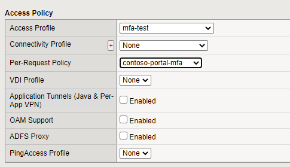

# Introduction

F5 Step up auth with SAML
Making a multi-step website using Radius
This chapter describes the setup of a step-up website. The initial website will request SAML authentication from Azure (with or without MFA), but will require the user to perform an MFA when reaching a particular URL within that website.

> - /* _regular SAML authentication_
> - /auth/* _step-up MFA authentication_

## Prerequisites

To get started, you need the following items:
- an application in Azure AD according to: [F5 - Creating an Enterprise Application in Azure AD](f5-aad.md)

- A configured Access Profile in F5 according to:
    [Manual Configuration of AAD as SAML provider](f5--aad-saml-manual.md)

### Architecture

The following architecture will be used:

### Per-Request Policy

In order to implement this, we need to have a Per-Session policy as well as a Per-Request policy.

The per-session policy will authenticate the user based on SAML (Azure AD) and grant access to the base of the website. The Per-Request policy will be implemented to monitor the URLs used and request the user to perform Radius Authentication if */auth/* is being accessed. Obviously the URL can be more strict.
To create the Per-Request policy:

1. Go to **Access >> Profiles / Policies : Per Request Policies** and click **create..**
2. Give a name to the policy [contoso-portal-mfa] and click **Finished**
3. Once the policy is created, click **Edit** in the Per-Request Policy column
4. A new window will be shown with Start--+--Allow
5. Click **Add New Subroutine**
6. Give the routine a name [Radius-MFA]

7. Click **Save**
1. Open the subroutine: Radius-MFA by clicking the **+** sign in front of it
1. A new flow is shown with In--->+-->Out
1. Click the **+** sign and a new window will open
1. Select the **authentication** tab and choose **Radius Auth**
1. Set the AAA server to the earlier created Radius entry [azure_mfa]
1. For the username source set it to: **%{subsession.logon.last.username}**
1. Click **Save** to put the Radius Auth in the flow
1. Click **Edit Terminals** to change the outcome
1. Click **Add Terminal** to add a second output
1. Rename **Terminal 1** to **Deny**
1. Rename **Out** to **Accept**
1. Click **^** on the Accept terminal to move it up

20. Click **Save**
1. Click the **Accept** terminal for the Radius Auth **fallback branch** and change it to **Deny**
1. Click the **+** in front of the Radius Auth (In-+-Radius Auth)
1. In the pop-up window select the **Assignment** tab
1. Select **Variable Assign** and then **Add Item**
1. On the pop-up window, select **Add new entry**
1. click **change** to create an assignment
1. On the left side of the window, select **Custom Variable** and **Secure**
1. In the text field type: **subsession.logon.last.username**
1. On the right side of the window select **Session Variable** and type: **session.saml.last.identity**
1. Click **Finished**
1. Click **Save**

This completes the subroutine creation.

1. In the Per-Request Policy flow, click **+**
1. In the pop-up window, select the **General Purpose** tab
1. Select the **URL Branching** object and click **Add item**
1. In the pop-up window for URL Branching select the **Branch Rules** tab
1. Change the name from **Allow** to **step-up** and select **change**
1. Click **Add Expression**
1. For the Agent Sel: select **URL Branching**
1. For the Condition, select **Glob Match**
1. For the URL glob pattern: ***/auth/***
1. Click **Add Expression**

11.	On the overview page, click the X to remove the URL Contains: domain.com to remove that condition.

12. Click **Finished**
1. Click **Save**
1. The URL branching object will be added with 2 branches – step-up & fallback
1. Click the **Reject** in the **fallback branch** and change it to **Allow**
1. Click the **+** on the step-up branch
1. In the pop-up select **Subroutines**
1. Select the Radius-MFA subroutine created earlier and click **Add Item**

19.	The policy is now complete

### Assigning the policy to a virtual server

The policy needs to be added to the published website, this can be done through the properties of the virtual server.

1. Go to **Local Traffic >> Virtual Servers** and select the virtual server hosting the webpage
1. Under the Access Policy section, select contoso-portal-mfa under the **per-request policy**
1. Add the SAML authentication policy under Access Profile

4.	Click **Update** to make the change active

### Testing

Open the main page (https://portal.contoso.com) and login to Azure AD (access policy). Go to the /auth/ url (https://portal.contoso.com/auth/) and the user will be triggered to perform an MFA. Note that it will only be a push notification or phone call.

### Troubleshooting

If it doesn't work like expected, add Logging items in the policies to see where things go wrong. Session logging can be viewed by going to:

**Access >> Overview : Active Sessions**

or

**Access >> Overview : Access Reports**